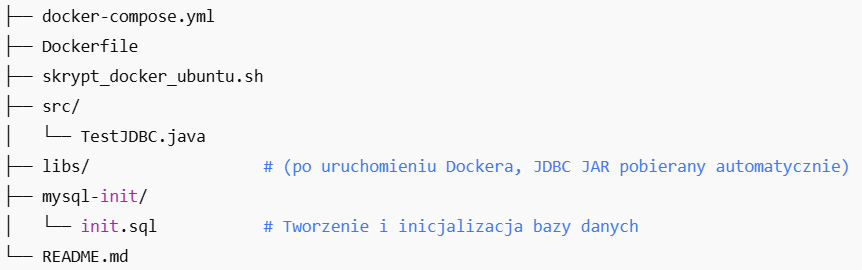

# Docker + Java + MySQL: Przykład aplikacji

Ten projekt demonstruje jak uruchomić prostą aplikację Java korzystającą z bazy danych MySQL za pomocą `docker-compose`.
Java + MySQL + Docker + phpMyAdmin – pełne środowisko uruchomieniowe z IntelliJ IDEA.

## Struktura projektu:


## Wymagania

- Ubuntu Desktop
- `git`, `docker`, `docker-compose`, `snap`

## Funkcjonalność

- Kontener MySQL 8.0 z bazą danych `sklep`, użytkownikiem `sprzedawca` i przykładową tabelą `TOWARY`.
- Kontener Java budujący i uruchamiający klasę `TestJDBC`, która łączy się z MySQL i wypisuje dane z tabeli.
- Kontener phpMyAdmin dostęp przez przeglądarkę

## Kroki na ćwiczenia:

1. Zaktualizuj listę repozytoriów i zainstaluj git:
    ```bash
   sudo apt update &&
   sudo apt install git
    ```
2. Sklonuj repo:
   ```bash
   git clone https://github.com/gacandrzej/Docker.git
   ```

3. Zmień uprawnienia dla skryptu:
```bash
   chmod +x skrypt_docker_ubuntu.sh
```
4. Uruchom skrypt:
   ```bash
   sudo ./skrypt_docker_ubuntu.sh
   ```

5. Test działania:
   ```bash
   sudo ./test_projektu.sh
   ```
6. Sprawdź phpMyAdmin:


   Dostępny pod adresem: http://localhost:8080


7. Uruchom intellij:
```bash
   sudo intellij-idea-community &
```
8. Otwórz plik TestJDBC.java


9. Dodaj plugin Docker


10. Przebudowa projektu w przypadku problemów:
   - Zmień Dockerfile: dodaj ściągnięcie narzędzia entr
   - przejdź do katalogu libs:
      ```bash
         cd ~/Docker/libs
      ```
   - Pobierz sterownik lokalnie wydając polecenie:
       ```bash
         sudo wget https://downloads.mysql.com/archives/get/p/3/file/mysql-connector-j-9.2.0.zip 
      ```
   - rozpakuj plik mysql-connector-j-9.2.0.zip:
      ```bash
         sudo unzip mysql-connector-j-9.2.0.zip
      ```
   - skopiuj mysql-connector-j-9.2.0.jar:
      ```bash
         sudo cp mysql-connector-j-9.2.0/mysql-connector-j-9.2.0.jar .
      ```
   - usunięcie kontenerów z danymi:
   ```bash
        sudo docker compose down -v
     ``` 
   - budowanie i uruchamianie:
   ```bash
        sudo docker compose up --build -d
     ```
   - sprawdzenie w części service w intelij konteneru java_app
   
11. Test działania:
   ```bash
   sudo ./test_projektu.sh
   ```
12. Śledzenie logów w czasie rzeczywistym:
   ```bash
   sudo  docker compose logs -f
   ```
13. KONIEC
   
