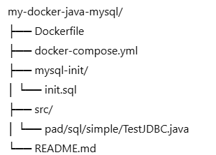

# Docker + Java + MySQL: Przykład aplikacji

Ten projekt demonstruje jak uruchomić prostą aplikację Java korzystającą z bazy danych MySQL za pomocą `docker-compose`.

## Struktura projektu:


## Funkcjonalność

- Kontener MySQL 8.0 z bazą danych `sklep`, użytkownikiem `sprzedawca` i przykładową tabelą `TOWARY`.
- Kontener Java budujący i uruchamiający klasę `TestJDBC`, która łączy się z MySQL i wypisuje dane z tabeli.

## Jak uruchomić?

1. Upewnij się, że masz zainstalowanego Dockera i `docker-compose`.
2. W terminalu przejdź do katalogu projektu:
   ```bash
   cd my-docker-java-mysql
3. Uruchom kontenery: docker-compose up --build
4. W konsoli powinna pojawić się lista towarów z bazy danych.

Użytkownik bazy danych
Nazwa bazy: sklep

Użytkownik: sprzedawca

Hasło: ...

Pliki
init.sql: skrypt inicjalizujący tabelę i przykładowe dane.

TestJDBC.java: prosty program łączący się z MySQL i wypisujący dane z tabeli.

## Kroki na ćwiczenia:
### 1) sklonuj repo:
git clone git@github.com:gacandrzej/Docker.git
### 2) Uruchom skrypt (skrypt w tym samym folderze co zip):
./skrypt_docker_ubuntu.sh

# Przebudowa projektu
1) sudo docker compose down -v  # usuń wolumen z danymi
2) sudo docker compose up --build -d
3) lub instalacja pluginu Docker

4) lub docker exec -it java_app bash
5) Pobierz sterownik lokalnie:
   Z oficjalnej strony:
   https://dev.mysql.com/downloads/connector/j/

Lub poleceniem:

wget https://repo1.maven.org/maven2/mysql/mysql-connector-java/8.0.33/mysql-connector-java-8.0.33.jar -P lib/
B. Zmień Dockerfile, aby skopiować plik JAR:
dockerfile

FROM openjdk:17-slim

WORKDIR /usr/src/myapp

# Skopiuj źródła i sterownik
COPY ./src /usr/src/myapp
COPY ./lib/mysql-connector-java-8.0.33.jar /usr/src/myapp/lib/

# Kompiluj z dołączonym sterownikiem
RUN javac -cp .:/usr/src/myapp/lib/mysql-connector-java-8.0.33.jar pad/sql/simple/TestJDBC.java

C. Zmień docker-compose.yml, aby uruchomić z klaspath:

command: bash -c "java -cp .:/usr/src/myapp/lib/mysql-connector-java-8.0.33.jar pad.sql.simple.TestJDBC"